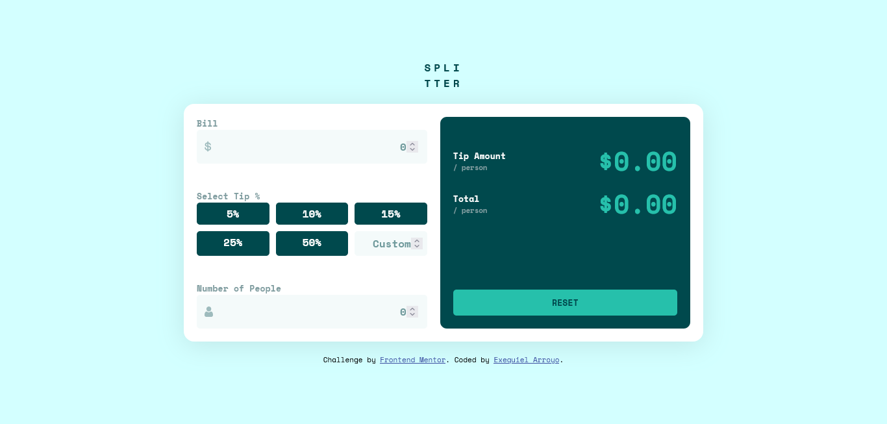

# Frontend Mentor - Tip calculator app solution

This is a solution to the [Tip calculator app challenge on Frontend Mentor](https://www.frontendmentor.io/challenges/tip-calculator-app-ugJNGbJUX). Frontend Mentor challenges help you improve your coding skills by building realistic projects.

## Table of contents

- [Overview](#overview)
  - [The challenge](#the-challenge)
  - [Screenshot](#screenshot)
  - [Links](#links)
- [My process](#my-process)
  - [Built with](#built-with)
  - [Useful resources](#useful-resources)

## Overview

### The challenge

Users should be able to:

- View the optimal layout for the app depending on their device's screen size
- See hover states for all interactive elements on the page
- Calculate the correct tip and total cost of the bill per person

### Screenshot

### Links

- Solution URL: [github](https://github.com/exequielarroyo/Tip-calculator-app)
- Live Site URL: [tip-calculator-app](https://exequielarroyo.github.io/Tip-calculator-app/)

## My process

### Built with

- CSS custom properties
- Flexbox
- CSS Grid

### Useful resources

- [custom radio button](https://www.youtube.com/watch?v=sSF0bXFUFGM) - This helped me for creating custom radio button reason.
